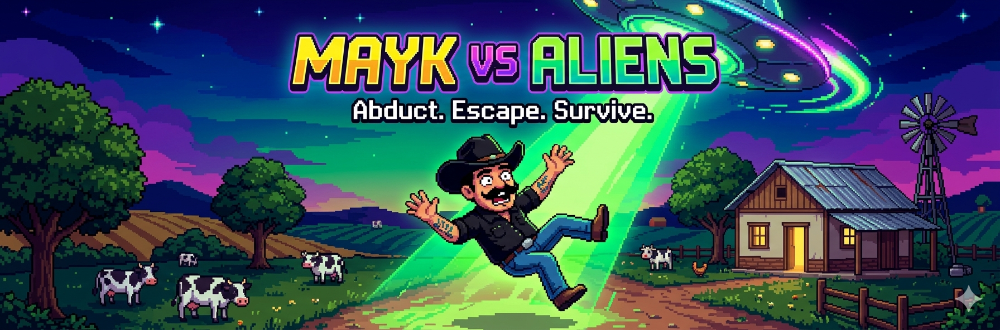
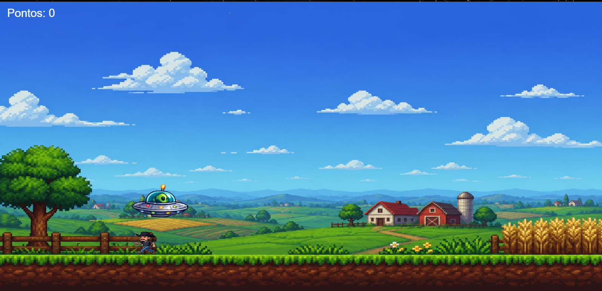
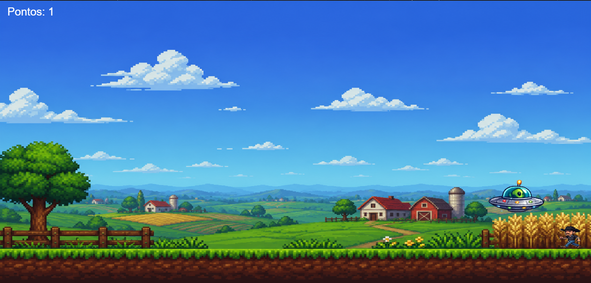

# 👽 Mayk vs Aliens



> Um jogo arcade feito em JavaScript + Canvas onde você controla uma nave alienígena e tenta capturar o Mayk Leão enquanto a dificuldade escala infinitamente.

---

## 🎮 Play Online

👉 **[Jogar agora](COLE_AQUI_LINK_DO_JOGO)**

---

## 🎬 Screenshots





---

## 🧩 Sobre o jogo

Em *Mayk vs Aliens*, você pilota uma nave alienígena em uma fazenda e precisa capturar o Mayk Leão usando seu raio de abdução.

Mas cuidado:  
quanto mais você joga, mais difícil ele fica.

---

## 🕹️ Controles

| Tecla | Ação |
|------|------|
| A / ← | Move para esquerda |
| D / → | Move para direita |
| SPACE | Ativa o raio de abdução |

---

## ✨ Features

- 🎯 Sistema de pontuação
- 📈 Dificuldade progressiva
- 🤖 IA simples do inimigo (Mayk foge da nave)
- 🔊 Música ambiente + efeitos sonoros
- 🛸 Animação de raio de abdução
- 🌾 Cenário estilo fazenda
- ⚡ Gameplay rápido estilo arcade

---

## 🧠 Tecnologias

- HTML5
- CSS3
- JavaScript puro
- Canvas API
- Web Audio API
- Event listeners (keyboard + input)

---


## 🔊 Áudio

- 🎵 Música de fundo original
- 🔫 Som de raio de abdução
- 🚀 Som de movimento da nave

---

## 📁 Estrutura
/sprites
/sounds
index.html
script.js
style.css


---

## 🚀 Como rodar localmente

```bash
git clone https://github.com/Richter06/mayk-vs-aliens.git
cd mayk-vs-aliens


